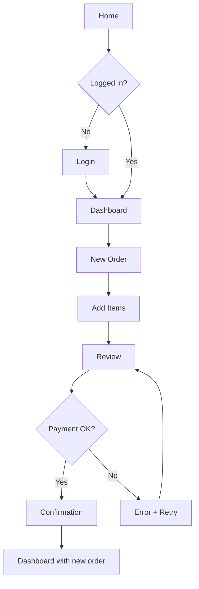

# UX Design Skill

> **Skill ID:** `ux-design`
> **Status:** active — see issue #20
> **Owner:** Jonathan (with Olivia as primary implementer)
> **Default loaders:** Jonathan, Olivia
> **On-demand loaders:** Sophia, Felix, Isabella, Daniel
> **Format follows:** [agentskills.io SKILL.md specification](https://agentskills.io)

---

## 1. Mission & When to Load

This skill equips any agent building user-facing features with structured UX thinking so they ship interfaces that are usable, accessible, and user-centered — not just functional.

**Trigger phrases that should auto-load this skill:**

- "form", "validation", "loading state", "error state", "empty state"
- "navigation", "breadcrumb", "menu", "tab"
- "accessibility", "a11y", "WCAG", "screen reader", "ARIA"
- "keyboard", "focus", "tab order", "escape", "enter"
- "responsive", "mobile-first", "breakpoint"
- "user flow", "user journey", "onboarding"
- "interaction pattern", "modal", "dialog", "dropdown", "tooltip"
- "notification", "toast", "alert", "confirmation"
- "usability", "UX", "heuristic", "user research"
- "perceived performance", "skeleton", "optimistic update"

**Mission:** Prevent AI-generated UIs that work but frustrate users — by encoding Nielsen's heuristics, WCAG 2.1 AA, interaction patterns, and user research methods directly into the agent's reasoning.

---

## 2. Nielsen's 10 Usability Heuristics

For each heuristic: name, definition, what AI agents typically do wrong, and what compliant OElite implementations look like.

### 2.1 Visibility of System Status

**Definition:** The system should always keep users informed about what is going on, through appropriate feedback within reasonable time.

**Violation (what AI agents typically do wrong):**
```tsx
// BAD: Button click with no feedback
<Button onClick={submitOrder}>Place Order</Button>
// User clicks, nothing happens for 2 seconds, they click again — double submission
```

**Compliant (correct OElite implementation):**
```tsx
// GOOD: Loading state on the button, progress communicated
<Button onClick={submitOrder} disabled={isSubmitting}>
  {isSubmitting ? (
    <>
      <Loader2 className="mr-2 h-4 w-4 animate-spin" />
      Processing order...
    </>
  ) : (
    'Place Order'
  )}
</Button>
// Plus: toast on success, toast on error with retry
```

---

### 2.2 User Control and Freedom

**Definition:** Users often choose system functions by mistake and need a clearly marked "emergency exit" to leave the unwanted state without going through an extended dialogue.

**Violation:**
```tsx
// BAD: Destructive action with no undo
<Button onClick={() => deleteAccount(userId)}>Delete Account</Button>
```

**Compliant:**
```tsx
// GOOD: Confirmation + undo window
const [pendingDelete, setPendingDelete] = useState<string | null>(null);

<AlertDialog open={!!pendingDelete} onOpenChange={() => setPendingDelete(null)}>
  <AlertDialogContent>
    <AlertDialogTitle>Delete this account?</AlertDialogTitle>
    <AlertDialogDescription>This action can be undone within 30 seconds.</AlertDialogDescription>
    <AlertDialogAction onClick={() => confirmDelete(pendingDelete!)}>Delete</AlertDialogAction>
    <AlertDialogCancel>Cancel</AlertDialogCancel>
  </AlertDialogContent>
</AlertDialog>

// After deletion: show toast with Undo button (time-limited)
toast.success('Account deleted', {
  action: { label: 'Undo', onClick: restoreAccount },
  duration: 30_000,
});
```

---

### 2.3 Consistency and Standards

**Definition:** Users should not have to wonder whether different words, situations, or actions mean the same thing. Follow platform conventions.

**Violation:**
```tsx
// BAD: Inconsistent button styles, mixing primary/destructive/ghost in same group
<div>
  <Button variant="destructive">Save</Button>  // destructive but action is save
  <Button variant="ghost">Delete</Button>         // ghost but action is destructive
  <Button variant="default">Cancel</Button>        // default
</div>
```

**Compliant:**
```tsx
// GOOD: Primary action uses default variant, destructive uses destructive, cancel uses outline
<div className="flex gap-2">
  <Button variant="default">Save</Button>
  <Button variant="destructive">Delete</Button>
  <Button variant="outline">Cancel</Button>
</div>
// Plus: use Shadcn Button variants consistently across the app
```

---

### 2.4 Error Prevention

**Definition:** Even better than good error messages is a careful design which prevents a problem from occurring in the first place.

**Violation:**
```tsx
// BAD: Free-text input where a select would prevent typos
<Input placeholder="Country code (e.g., US, UK, DE)" />
// User types "USA" or "United States" — broken
```

**Compliant:**
```tsx
// GOOD: Constrained input with autocomplete, prevent invalid values
<Select onValueChange={setCountry}>
  <SelectTrigger>
    <SelectValue placeholder="Select country" />
  </SelectTrigger>
  <SelectContent>
    {countries.map(c => <SelectItem key={c.code} value={c.code}>{c.name}</SelectItem>)}
  </SelectContent>
</Select>
```

---

### 2.5 Recognition Rather Than Recall

**Definition:** Minimize the user's memory load by making objects, actions, and options visible. The user should not have to remember information from one part of the dialogue to another.

**Violation:**
```tsx
// BAD: "Enter the code we sent to your phone" — user has to switch context
<Input placeholder="Verification code" />
```

**Compliant:**
```tsx
// GOOD: Show context inline, allow paste from SMS
<Input
  placeholder="6-digit code"
  value={code}
  onChange={...}
  autoComplete="one-time-code"  // mobile: auto-fills from SMS
/>
<p className="text-sm text-muted-foreground">
  Sent to +1 (555) 123-4567. <button onClick={resendCode}>Resend</button>
</p>
```

---

### 2.6 Flexibility and Efficiency of Use

**Definition:** Accelerators (often invisible to the novice user) may often speed up the interaction for the expert user.

**Violation:**
```tsx
// BAD: No keyboard shortcuts, slow for power users
// Power user has to click "Save" 50 times a day
```

**Compliant:**
```tsx
// GOOD: Keyboard shortcuts for common actions
function Editor() {
  useHotkeys('mod+s', (e) => { e.preventDefault(); save(); });  // Cmd+S
  useHotkeys('mod+enter', (e) => { e.preventDefault(); publish(); });
  useHotkeys('mod+k', (e) => { e.preventDefault(); openCommandPalette(); });

  return (
    <div>
      <Editor />
      <p className="text-xs text-muted-foreground">⌘S to save · ⌘Enter to publish</p>
    </div>
  );
}
```

---

### 2.7 Aesthetic and Minimalist Design

**Definition:** Dialogues should not contain information which is irrelevant or rarely needed. Every extra unit of information in a dialogue competes with the relevant units of information and diminishes their relative visibility.

**Violation:**
```tsx
// BAD: Cluttered form, all fields visible at once
<form>
  <h1>Sign up</h1>
  <Input placeholder="First name" />
  <Input placeholder="Last name" />
  <Input placeholder="Email" />
  <Input placeholder="Phone" />
  <Input placeholder="Company" />
  <Input placeholder="Job title" />
  <Input placeholder="Address line 1" />
  <Input placeholder="Address line 2" />
  <Input placeholder="City" />
  <Input placeholder="State" />
  <Input placeholder="Zip" />
  <Input placeholder="Country" />
  <Input placeholder="How did you hear about us?" />  // rarely used, demotivates
  <Button>Sign up</Button>
</form>
```

**Compliant:**
```tsx
// GOOD: Multi-step with progress, only essential fields per step
<form>
  <Progress value={33} />
  <h1>Create your account</h1>
  <Input placeholder="Email" autoComplete="email" />
  <Input type="password" placeholder="Password" autoComplete="new-password" />
  <Button type="submit">Continue</Button>
  <p className="text-sm text-muted-foreground">Step 1 of 3 · Already have an account? <Link href="/login">Sign in</Link></p>
</form>
```

---

### 2.8 Help Users Recognize, Diagnose, and Recover from Errors

**Definition:** Error messages should be expressed in plain language (no codes), precisely indicate the problem, and constructively suggest a solution.

**Violation:**
```tsx
// BAD: Cryptic error code, no actionable guidance
toast.error('Error 0x80004005: Operation failed');
```

**Compliant:**
```tsx
// GOOD: Specific problem + recovery action
toast.error('Could not save your changes', {
  description: 'Your internet connection was lost. We saved a draft — try again in a moment.',
  action: { label: 'Retry now', onClick: retry },
});
```

---

### 2.9 Help and Documentation

**Definition:** Even though it is better if the system can be used without documentation, help and documentation may be necessary. Any such information should be easy to search, focused on the user's task, list concrete steps to be carried out, and not be too large.

**Violation:**
```tsx
// BAD: 50-page PDF user manual linked from the footer
<Link href="/manual.pdf">User manual (PDF, 12MB)</Link>
```

**Compliant:**
```tsx
// GOOD: Contextual help, searchable, task-focused
<Dialog>
  <DialogTrigger asChild>
    <Button variant="ghost" size="icon" aria-label="Help">
      <HelpCircle className="h-4 w-4" />
    </Button>
  </DialogTrigger>
  <DialogContent>
    <DialogHeader>
      <DialogTitle>How to create an order</DialogTitle>
    </DialogHeader>
    <Input placeholder="Search help..." />
    <ol className="space-y-2 text-sm">
      <li>1. Click "New order" in the top right</li>
      <li>2. Add products from the catalog</li>
      <li>3. Review and confirm shipping</li>
    </ol>
  </DialogContent>
</Dialog>
```

---

### 2.10 Help and Documentation (Recovery from Errors)

**Definition:** Even better than good error messages is a careful design which prevents a problem from occurring in the first place — combined with undo and recovery.

*Note: this overlaps with 2.4 Error Prevention and 2.2 User Control — see those sections for detailed examples.*

**Pattern:** Every destructive or irreversible action should have either a confirmation (before action) OR an undo (after action) — preferably both.

---

## 3. User Research Methods (Lightweight)

When agents are uncertain about a UX decision, they should know when to flag for human review vs. when to make a defensible call themselves.

### 3.1 When to Flag for Human UX Review

Agents MUST flag for human UX review (do not decide autonomously) when:

- **Novel product area** — no existing pattern in the OElite platform to reference
- **High-impact decision** — affects conversion, retention, revenue, security
- **Multiple valid approaches** — trade-offs involve user preference (e.g., wizard vs. single page)
- **Accessibility uncertainty** — not sure how to make it work for screen readers or keyboard
- **Brand-new user persona** — designing for a user type with no prior research
- **Touches a regulatory area** — GDPR consent flow, financial disclosure, healthcare data

**How to flag:** Post a comment on the issue with `@jonathan` mention describing the decision, trade-offs, and recommendation. Do NOT block implementation while waiting — proceed with the most defensible default and note the flag.

### 3.2 Methods Agents Can Apply Themselves

These are lightweight enough that an agent can use them during implementation:

- **Heuristic evaluation** — apply Nielsen's 10 heuristics (above) to the design
- **Cognitive walkthrough** — step through the user flow as if you've never seen the app
- **Edge case brainstorming** — list 5-10 edge cases (empty state, error, slow network, very long input, etc.) and verify each is handled
- **Accessibility self-check** — run the WCAG 2.1 AA checklist (§5 below)
- **Reviewer feedback** — read prior review comments on similar features

### 3.3 Methods Requiring Human Researchers

- Usability testing with real users
- A/B testing
- Card sorting for IA
- Tree testing for navigation
- User interviews / surveys
- Diary studies

When these are needed, the agent should explicitly request them in the issue, not try to simulate them.

### 3.4 Bias Awareness

Agents must be aware of these biases and mitigate them:

- **Self-referential design** — designing for "users like me" (the agent's own preferences)
- **Anchoring on first idea** — sticking with the first solution instead of exploring alternatives
- **Feature bias** — assuming more features = better, when often the opposite is true
- **Optimistic scenario** — designing only the happy path, missing error/empty/loading states
- **Cultural bias** — assuming US/Western conventions (date formats, names, color meanings)

**Mitigation:** When in doubt, ask "what would a 65-year-old non-technical user in Japan do here?"

---

## 4. Interaction Design Patterns

For each pattern, provide a TSX shape that OElite-compliant agents should default to.

### 4.1 Form Validation

```tsx
// GOOD: Inline validation, async server errors, focus management, ARIA-live for screen readers
function SignupForm() {
  const [email, setEmail] = useState('');
  const [emailError, setEmailError] = useState<string | null>(null);
  const [serverError, setServerError] = useState<string | null>(null);
  const [isSubmitting, setIsSubmitting] = useState(false);

  const validateEmail = (value: string) => {
    if (!value) return 'Email is required';
    if (!/^[^@]+@[^@]+\.[^@]+$/.test(value)) return 'Enter a valid email address';
    return null;
  };

  const handleSubmit = async (e: FormEvent) => {
    e.preventDefault();
    const err = validateEmail(email);
    if (err) { setEmailError(err); return; }

    setIsSubmitting(true);
    setServerError(null);
    try {
      await api.signup({ email });
      router.push('/welcome');
    } catch (e) {
      // Specific, actionable error
      setServerError(
        e.code === 'EMAIL_TAKEN'
          ? 'An account with this email already exists. Try signing in instead.'
          : 'Something went wrong on our end. Please try again.'
      );
    } finally {
      setIsSubmitting(false);
    }
  };

  return (
    <form onSubmit={handleSubmit} noValidate>
      <Label htmlFor="email">Email</Label>
      <Input
        id="email"
        type="email"
        value={email}
        onChange={(e) => { setEmail(e.target.value); setEmailError(validateEmail(e.target.value)); }}
        aria-invalid={!!emailError}
        aria-describedby="email-error"
        autoComplete="email"
        autoFocus
      />
      {emailError && (
        <p id="email-error" role="alert" className="text-sm text-destructive">
          {emailError}
        </p>
      )}
      {/* aria-live announces server errors to screen readers */}
      <div role="alert" aria-live="polite" className="sr-only">
        {serverError}
      </div>
      {serverError && <p className="text-sm text-destructive">{serverError}</p>}

      <Button type="submit" disabled={isSubmitting || !!emailError}>
        {isSubmitting ? 'Creating account...' : 'Sign up'}
      </Button>
    </form>
  );
}
```

---

### 4.2 Loading States

```tsx
// GOOD: Skeleton loaders (not spinners for content), spinners for actions
function ProductList() {
  const { data, isLoading } = useProducts();

  if (isLoading) {
    // Skeleton matches the actual layout — no jump when content loads
    return (
      <div className="grid grid-cols-3 gap-4">
        {Array.from({ length: 6 }).map((_, i) => (
          <Card key={i}>
            <Skeleton className="h-48 w-full" />
            <CardHeader>
              <Skeleton className="h-4 w-3/4" />
              <Skeleton className="h-4 w-1/2" />
            </CardHeader>
          </Card>
        ))}
      </div>
    );
  }

  return <ProductGrid products={data} />;
}
```

---

### 4.3 Error States

```tsx
// GOOD: Specific error, recovery action, not a generic "something went wrong"
function DataView() {
  const { data, error, refetch } = useData();

  if (error) {
    return (
      <Card className="border-destructive">
        <CardHeader>
          <CardTitle className="flex items-center gap-2">
            <AlertCircle className="h-5 w-5 text-destructive" />
            Couldn't load your data
          </CardTitle>
        </CardHeader>
        <CardContent>
          <p className="text-sm text-muted-foreground">
            {error.code === 'NETWORK'
              ? 'Check your internet connection and try again.'
              : 'Our servers are having trouble. We\'ve been notified.'}
          </p>
        </CardContent>
        <CardFooter className="gap-2">
          <Button onClick={() => refetch()}>
            <RefreshCw className="mr-2 h-4 w-4" /> Try again
          </Button>
          <Button variant="outline" onClick={() => router.push('/help')}>
            Get help
          </Button>
        </CardFooter>
      </Card>
    );
  }

  return <DataDisplay data={data} />;
}
```

---

### 4.4 Empty States

```tsx
// GOOD: Guidance + primary action, not just "No data"
function Inbox() {
  const { messages } = useMessages();

  if (messages.length === 0) {
    return (
      <div className="flex flex-col items-center justify-center py-16 text-center">
        <InboxIcon className="h-16 w-16 text-muted-foreground/50" />
        <h3 className="mt-4 text-lg font-semibold">Your inbox is empty</h3>
        <p className="mt-2 text-sm text-muted-foreground max-w-sm">
          When you receive a message, it will appear here.
          Need to send a message? Get started below.
        </p>
        <Button className="mt-6">
          <Plus className="mr-2 h-4 w-4" /> Compose your first message
        </Button>
      </div>
    );
  }

  return <MessageList messages={messages} />;
}
```

---

### 4.5 Confirmation Dialogs

```tsx
// GOOD: When to confirm vs undo
// CONFIRM BEFORE: irreversible, costly, or external side effects
// UNDO AFTER: reversible internal actions

// Irreversible — use AlertDialog BEFORE
<AlertDialog>
  <AlertDialogTrigger asChild>
    <Button variant="destructive">Delete project</Button>
  </AlertDialogTrigger>
  <AlertDialogContent>
    <AlertDialogTitle>Delete this project?</AlertDialogTitle>
    <AlertDialogDescription>
      This will permanently delete the project and all 247 files.
      This action cannot be undone.
    </AlertDialogDescription>
    <AlertDialogFooter>
      <AlertDialogCancel>Cancel</AlertDialogCancel>
      <AlertDialogAction onClick={deleteProject}>Delete project</AlertDialogAction>
    </AlertDialogFooter>
  </AlertDialogContent>
</AlertDialog>

// Reversible — use toast with Undo AFTER
function handleArchive(item) {
  api.archive(item.id);
  toast.success('Item archived', {
    action: { label: 'Undo', onClick: () => api.unarchive(item.id) },
    duration: 5_000,
  });
}
```

---

### 4.6 Pagination vs Infinite Scroll

Use this decision matrix:

| Scenario | Pattern | Why |
|---|---|---|
| Search results, e-commerce catalogs | **Pagination** | Predictable, shareable URLs, accessible |
| Social feed, news stream | **Infinite scroll** | Engagement, exploration, no clear endpoint |
| Admin tables, data export | **Pagination** | Users need to know total count, jump to page |
| Mobile-first content | **Infinite scroll** with "Load more" button | Bandwidth, battery, control |
| < 50 items total | **Show all** | Pagination overhead not worth it |
| > 1000 items | **Pagination or virtualized list** | Performance |

### 4.7 Multi-Step Flows

```tsx
// GOOD: Progress indicator, breadcrumbs, save & resume, back button always works
function CheckoutFlow() {
  const [step, setStep] = useState(1);
  const totalSteps = 3;
  const [draft, setDraft] = usePersistedDraft('checkout'); // localStorage

  return (
    <div>
      <Progress value={(step / totalSteps) * 100} />
      <Breadcrumb>
        <BreadcrumbItem>Cart</BreadcrumbItem>
        <BreadcrumbItem active={step === 2}>Shipping</BreadcrumbItem>
        <BreadcrumbItem active={step === 3}>Payment</BreadcrumbItem>
      </Breadcrumb>

      {step === 1 && <CartStep draft={draft} setDraft={setDraft} />}
      {step === 2 && <ShippingStep draft={draft} setDraft={setDraft} />}
      {step === 3 && <PaymentStep draft={draft} setDraft={setDraft} />}

      <div className="flex justify-between mt-6">
        <Button variant="outline" onClick={() => setStep(s => s - 1)} disabled={step === 1}>
          Back
        </Button>
        <Button onClick={() => setStep(s => s + 1)} disabled={step === totalSteps}>
          Continue
        </Button>
      </div>

      <p className="text-xs text-muted-foreground mt-4">
        Your progress is saved automatically. You can close this and return later.
      </p>
    </div>
  );
}
```

---

## 5. Accessibility — WCAG 2.1 AA Checklist (Self-Verifiable)

Agents MUST self-check every item below before declaring UI work complete. Failing any item is a hard blocker.

### Perceivable

- [ ] All images have meaningful `alt` text (or `alt=""` for decorative)
- [ ] All form inputs have associated `<Label>` or `aria-label`
- [ ] Text contrast ratio ≥ 4.5:1 (normal text) or ≥ 3:1 (large text 18pt+)
- [ ] UI component contrast ≥ 3:1
- [ ] Color is not the only means of conveying information (use icons + text too)
- [ ] Audio/video has captions and transcripts
- [ ] Page has logical reading order (DOM order = visual order)

### Operable

- [ ] All functionality available via keyboard (Tab, Shift+Tab, Enter, Space, Escape, arrows)
- [ ] No keyboard traps (focus can always leave any element)
- [ ] Focus indicator visible (≥ 2px outline, ≥ 3:1 contrast) on every focusable element
- [ ] Skip-to-content link at the top of the page
- [ ] Touch targets ≥ 44x44px on mobile
- [ ] No content flashes more than 3 times per second
- [ ] `prefers-reduced-motion` respected (animations disabled or reduced)
- [ ] Page titles describe the page content
- [ ] Link text describes the destination (no "click here")
- [ ] Multiple ways to find pages (nav menu + search + breadcrumb)

### Understandable

- [ ] `<html lang="en">` (or appropriate language)
- [ ] Navigation is consistent across pages
- [ ] Form errors are identified in text (not just color)
- [ ] Labels and instructions are clear
- [ ] Error prevention for legal/financial transactions (confirm + reversible)
- [ ] Context-sensitive help available

### Robust

- [ ] Valid HTML (no unclosed tags, no invalid nesting)
- [ ] ARIA roles used correctly (e.g., `role="navigation"` for `<nav>`, `role="button"` for clickable non-buttons)
- [ ] All interactive elements have accessible name (`aria-label`, visible text, or `aria-labelledby`)
- [ ] Status messages use `aria-live="polite"` or `aria-live="assertive"`
- [ ] Modals trap focus and restore focus on close
- [ ] Dynamic content changes are announced

---

## 6. Information Architecture

### 6.1 Navigation Hierarchy

- **Global navigation** — always visible, top-level sections (Home, Products, Account, Help)
- **Section navigation** — within a section, left sidebar or top tabs
- **Contextual navigation** — within a page, breadcrumbs, related items, "next/previous"
- **Utility navigation** — settings, profile, logout (top right or footer)

**Rule of thumb:** No page should be more than 3 clicks from the home page.

### 6.2 IA for Different Surfaces

| Surface | IA pattern | Example |
|---|---|---|
| **Dashboard** | Card grid by domain | Sales, Marketing, Support cards |
| **Form** | Linear (top-to-bottom) or stepped (multi-page) | Onboarding wizard |
| **Data table** | Tabular with sort/filter | User list |
| **Detail page** | Summary at top, tabs for sections, related items at bottom | Order detail |
| **Marketing** | Hero → features → social proof → CTA | Landing page |

### 6.3 Breadcrumbs

Always show breadcrumbs for any page 2+ levels deep:

```
Home > Products > Electronics > Laptops > MacBook Pro 16"
```

Use Shadcn `Breadcrumb` component. Make the last segment non-clickable (current page).

---

## 7. Mobile vs Desktop UX

### 7.1 What Changes on Mobile

- **Touch targets** — minimum 44x44px (Apple HIG), 48x48dp (Material)
- **Gestures** — swipe to delete (with undo), pull-to-refresh, long-press for context menu
- **Navigation** — bottom tab bar or hamburger drawer (thumb-reachable zone, bottom 1/3 of screen)
- **Forms** — larger inputs, native keyboards (`inputMode="email"`, `inputMode="numeric"`)
- **Content** — prioritize, show less, defer non-essential
- **Modals** — use bottom sheet instead of centered modal (thumb reach)
- **Hover** — replace with long-press or explicit tap

### 7.2 Responsive vs Adaptive

- **Responsive** (preferred) — same HTML, different CSS at breakpoints. Faster to build, easier to maintain.
- **Adaptive** (when needed) — different layouts served by JS detection. Use only when responsive can't achieve the goal (e.g., drastically different data needs).

### 7.3 Breakpoints (Tailwind defaults)

```
sm:  640px   — small tablets, large phones (landscape)
md:  768px   — tablets
lg:  1024px  — laptops, small desktops
xl:  1280px  — desktops
2xl: 1536px  — large desktops
```

Mobile-first: design for `sm` first, then scale up.

---

## 8. Performance UX (Perceived Performance)

### 8.1 Why Perceived Performance Matters More Than Actual

Users forgive actual slowness if the UI feels responsive. They don't forgive a UI that feels broken (blank screen, no feedback, frozen button).

### 8.2 Patterns for Perceived Speed

- **Skeleton screens** — show placeholder structure immediately, not a spinner
- **Optimistic updates** — apply the change immediately, rollback on server error
- **Pre-fetching on hover** — fetch data the user is about to click
- **Progressive image loading** — blur-up technique, lazy load below-the-fold
- **Critical CSS inline** — render above-the-fold without waiting for full CSS
- **Service worker for repeat visits** — instant load on return

### 8.3 When Spinner is OK

- User explicitly triggered a long action (file upload, export)
- Initial page load with no content structure to show

Otherwise: skeleton > spinner.

### 8.4 Performance Budgets

| Metric | Target | Why |
|---|---|---|
| **LCP** (Largest Contentful Paint) | < 2.5s | Perceived load speed |
| **FID** (First Input Delay) | < 100ms | Interactivity |
| **CLS** (Cumulative Layout Shift) | < 0.1 | Visual stability |
| **TTFB** (Time to First Byte) | < 800ms | Server response |

Use Lighthouse CI to enforce in PR checks.

---

## 9. User Flow Design

### 9.1 Flow Components

- **Entry point** — where does the user come from? (homepage, search, email link, notification)
- **Goal** — what is the user trying to accomplish?
- **Steps** — what's the minimum path to the goal?
- **Exit points** — where can they leave cleanly? (save & resume, cancel)
- **Error states** — what can go wrong at each step?
- **Recovery** — how does the user get back on track?

### 9.2 Mermaid Diagram (Use for Complex Flows)



### 9.3 Dead-End Prevention

Every page must have at least one of:
- A primary action button
- A link to the next logical step
- A clear path back to a meaningful location (Home, Dashboard)
- A search bar to find something else

---

## 10. Before/After Examples

### Example A: Poor Form vs Compliant Form

**Before (BAD):**
```tsx
function BadForm() {
  return (
    <form>
      <input placeholder="Email" />
      <input type="password" placeholder="Password" />
      <button>Submit</button>
      {/* No validation, no error messages, no ARIA, no loading state, no keyboard support */}
    </form>
  );
}
```

**After (GOOD):** See section 4.1 for the compliant version with inline validation, focus management, ARIA-live for screen readers, and async server error handling.

---

### Example B: Dashboard with Only Happy State

**Before (BAD):**
```tsx
function BadDashboard() {
  const [data, setData] = useState(null);
  useEffect(() => { fetch('/api/dashboard').then(r => r.json()).then(setData); }, []);
  return (
    <div>
      <h1>Dashboard</h1>
      {data && <Dashboard data={data} />}
      {/* No loading state, no error state, no empty state */}
    </div>
  );
}
```

**After (GOOD):**
```tsx
function GoodDashboard() {
  const { data, isLoading, error, refetch } = useDashboard();

  if (isLoading) return <DashboardSkeleton />;  // See section 4.2
  if (error) return <DashboardError error={error} onRetry={refetch} />;  // See section 4.3
  if (data.metrics.length === 0) return <DashboardEmptyState />;  // See section 4.4

  return <DashboardContent data={data} />;
}
```

---

### Example C: Destructive Action Without Confirmation/Undo

**Before (BAD):**
```tsx
function BadDelete() {
  return <button onClick={() => api.deleteAccount(userId)}>Delete account</button>;
  // No confirmation, no undo, no error handling
}
```

**After (GOOD):** See section 2.2 for the compliant version with AlertDialog (confirmation) and toast with Undo (recovery).

---

## 11. WCAG 2.1 AA Self-Verification Workflow

Agents MUST run this workflow before declaring UI work complete:

```bash
# 1. Automated aXe scan
npx @axe-core/cli http://localhost:3000/<your-page>
# 2. Lighthouse accessibility audit
npx lighthouse http://localhost:3000/<your-page> --only-categories=accessibility
# 3. Manual keyboard navigation test
# - Tab through entire page
# - Verify all interactive elements reachable
# - Verify focus indicator visible everywhere
# - Verify Escape closes modals, returns focus
# 4. Screen reader spot check (VoiceOver on Mac, NVDA on Windows)
# - Verify all images have alt text announced
# - Verify form errors announced via aria-live
# - Verify navigation landmarks work
# 5. Color contrast check
# - Run axe-core (above) — it checks all text
# 6. Mobile viewport check
# - Resize to 375px wide
# - Verify no horizontal scroll
# - Verify touch targets ≥ 44x44px
```

**If ANY check fails, the work is not done. Fix and re-run.**

---

## 12. Cross-References

This skill complements:

- **`frontend-design` skill** (#21, Sophia) — visual design, design tokens, Shadcn/ui. Load both together for new UI features.
- **`security-design` skill** (#22, Maya) — when UX decisions interact with security (e.g., auth flows, permission gates, PII handling).
- **`architecture-design` skill** (#19, Marcus) — when UX decisions affect data model or API design (e.g., pagination strategy, optimistic updates).
- **`agents/packs/ux-design.md`** — task pack for Jonathan when formally planning UX.
- **`agents/roles/olivia.md`** — Olivia runs the accessibility self-checks (Gate 10) on every feature.

**Related standards:**
- WCAG 2.1 AA — https://www.w3.org/WAI/WCAG21/quickref/
- Nielsen Norman Group — https://www.nngroup.com/articles/ten-usability-heuristics/
- aXe-core — https://github.com/dequelabs/axe-core
- Inclusive Components — https://inclusive-components.design/

---

## 13. Summary — 10 Things to Remember

1. **Every form has loading, error, empty, success states** — not just success
2. **Every destructive action has confirmation OR undo** — preferably both
3. **Every image has alt text** — even if `alt=""` for decorative
4. **Every interactive element is keyboard-reachable** with visible focus
5. **Every error message is specific + actionable** — not "Error 0x80004005"
6. **Every page > 2 levels deep has breadcrumbs**
7. **Every page has a next step** — no dead ends
8. **Every animation respects `prefers-reduced-motion`**
9. **Every mobile touch target is ≥ 44x44px**
10. **Every UI work passes the WCAG 2.1 AA checklist** before merge
